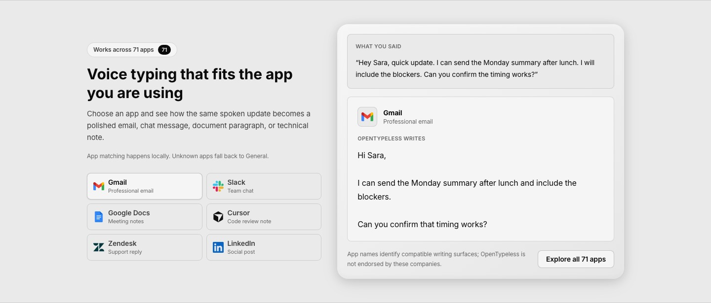
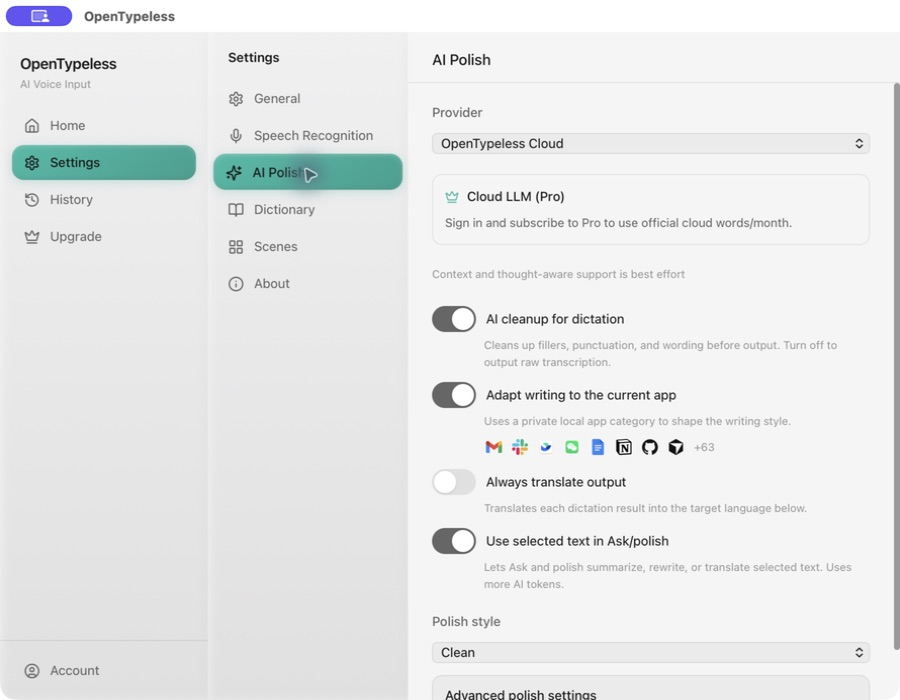
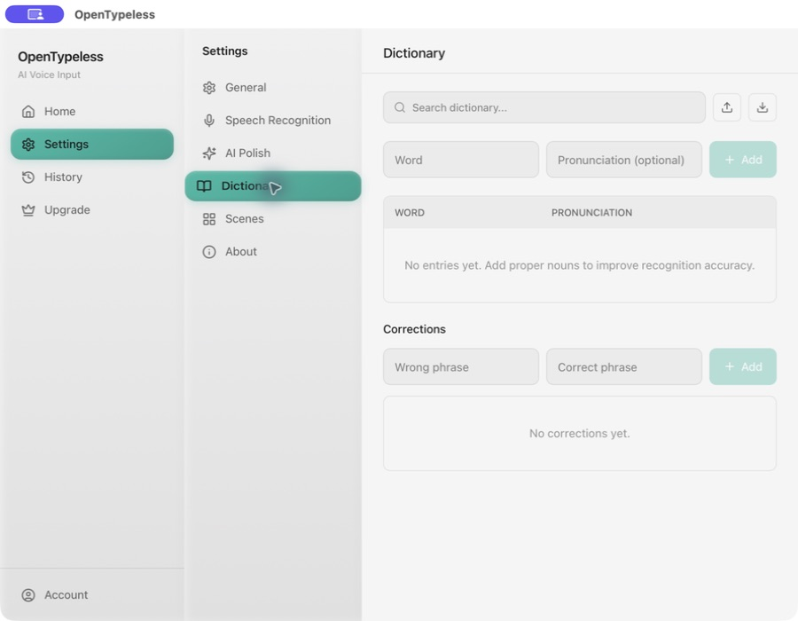

<p align="center">
  <a href="README.md">English</a> | <a href="README_zh.md">中文</a> | <a href="README_ja.md">日本語</a> | <a href="README_ko.md">한국어</a> | <strong>Español</strong> | <a href="README_fr.md">Français</a> | <a href="README_de.md">Deutsch</a> | <a href="README_pt.md">Português</a> | <a href="README_ru.md">Русский</a> | <a href="README_ar.md">العربية</a> | <a href="README_hi.md">हिन्दी</a> | <a href="README_it.md">Italiano</a> | <a href="README_tr.md">Türkçe</a> | <a href="README_vi.md">Tiếng Việt</a> | <a href="README_th.md">ภาษาไทย</a> | <a href="README_id.md">Bahasa Indonesia</a> | <a href="README_pl.md">Polski</a> | <a href="README_nl.md">Nederlands</a>
</p>

<p align="center">
  
</p>

<h1 align="center">OpenTypeless</h1>

<p align="center">
  Entrada de voz con IA de código abierto para escritorio. Habla con naturalidad, obtén texto pulido en cualquier aplicación.
</p>

<p align="center">
  Ya sea que estés escribiendo correos, programando, chateando o tomando notas — solo presiona una tecla,<br/>
  di lo que piensas, y OpenTypeless transcribe y pule tus palabras con IA,<br/>
  luego las escribe directamente en cualquier aplicación que estés usando.
</p>

<p align="center">
  <a href="https://github.com/tover0314-w/opentypeless/actions/workflows/ci.yml"></a>
  <a href="https://github.com/tover0314-w/opentypeless/releases"></a>
  <a href="LICENSE"></a>
  <a href="https://github.com/tover0314-w/opentypeless/stargazers"></a>
  <a href="https://discord.gg/V6rRpJ4RGD"></a>
</p>

<p align="center">
  
</p>

## Novedades de v1.1.49

- **Escritura adaptada a cada aplicación** detecta localmente la aplicación activa y ajusta la estructura y el tono para correo, chat, documentos, gestores de incidencias, herramientas de desarrollo y más.
- **Enrutamiento de intención por voz** distingue entre dictado, edición del texto seleccionado, traducción, Ask Anything y acciones de voz compatibles en inglés, chino simplificado y chino tradicional.
- **Varios atajos por flujo de trabajo** permiten añadir y ordenar más de una combinación para Dictado, Ask Anything y Traducción.
- **Destinos de traducción intercambiables** facilitan cambiar entre los idiomas que utilizas sin fijar una única lengua de salida.
- **Un diccionario local más completo** incorpora reglas de corrección e importación y exportación del diccionario.
- **Asignaciones de estilo por aplicación** permiten sustituir la categoría integrada cuando una aplicación necesita otro estilo de escritura.

La detección de aplicaciones, los mapeos, el diccionario y las reglas de corrección se guardan localmente. El pulido consciente de la aplicación solo envía a la ruta LLM configurada la categoría interna de la aplicación y metadatos de estilo aprobados; los títulos de ventana sin procesar y el contenido de los documentos no se envían como contexto ni se guardan en el historial.

| Pulido con IA adaptado a la aplicación | Diccionario local y correcciones |
| --- | --- |
|  |  |

<details>
<summary>Más capturas de pantalla</summary>

<p align="center">
  
</p>

| Configuración | Historial |
|---|---|
|  |  |

</details>

---

## ¿Por qué OpenTypeless?

| | OpenTypeless | Dictado de macOS | Escritura por voz de Windows | Whisper Desktop |
|---|---|---|---|---|
| Pulido de texto con IA | ✅ Múltiples LLMs | ❌ | ❌ | ❌ |
| Elección de proveedor STT | ✅ 6+ proveedores | ❌ Solo Apple | ❌ Solo Microsoft | ❌ Solo Whisper |
| Funciona en cualquier app | ✅ | ✅ | ✅ | ❌ Copiar-pegar |
| Modo traducción | ✅ | ❌ | ❌ | ❌ |
| Código abierto | ✅ MIT | ❌ | ❌ | ✅ |
| Multiplataforma | ✅ Win/Mac/Linux | ❌ Solo Mac | ❌ Solo Windows | ✅ |
| Diccionario personalizado | ✅ | ❌ | ❌ | ❌ |
| Auto-alojable | ✅ BYOK | ❌ | ❌ | ✅ |

## Características

- 🎙️ Tecla de acceso rápido global — mantener para grabar o alternar
- 💊 Widget cápsula flotante, siempre visible
- 🗣️ 6+ proveedores STT: Deepgram, AssemblyAI, Whisper, Groq, GLM-ASR, SiliconFlow
- 🤖 Pulido de texto con múltiples LLMs: OpenAI, DeepSeek, Claude, Gemini, Ollama y más
- ⚡ Salida en streaming — el texto aparece mientras el LLM lo genera
- ⌨️ Salida por simulación de teclado o portapapeles
- 📝 Selecciona texto antes de grabar para dar contexto al LLM
- 🌐 Modo traducción: habla en un idioma, obtén la salida en otro (20+ idiomas)
- 📖 Diccionario personalizado para términos específicos
- 🔍 Detección por aplicación para adaptar el formato
- 📜 Historial local con búsqueda de texto completo
- 🌗 Tema oscuro / claro / sistema
- 🚀 Inicio automático al iniciar sesión

> [!TIP]
> **Configuración recomendada para la mejor experiencia**
>
> | | Proveedor | Modelo |
> |---|---|---|
> | 🗣️ STT | Groq | `whisper-large-v3-turbo` |
> | 🤖 Pulido IA | Google | `gemini-2.5-flash` |
>
> Esta combinación ofrece transcripción rápida y precisa con pulido de texto de alta calidad — y ambos ofrecen generosos niveles gratuitos.

## Descargar

Descarga la última versión para tu plataforma:

**[Descargar desde Releases](https://github.com/tover0314-w/opentypeless/releases)**

| Plataforma | Archivo |
|------------|---------|
| Windows | Instalador `.msi` |
| macOS (Apple Silicon) | `.dmg` |
| macOS (Intel) | `.dmg` |
| Linux | `.AppImage` / `.deb` |

## Requisitos previos

- [Node.js](https://nodejs.org/) 20+
- [Rust](https://rustup.rs/) (toolchain estable)
- Dependencias específicas de plataforma para Tauri: consulta [Requisitos previos de Tauri](https://v2.tauri.app/start/prerequisites/)

## Primeros pasos

```bash
# Instalar dependencias
npm install

# Ejecutar en modo desarrollo
npm run tauri dev

# Compilar para producción
npm run tauri build
```

La aplicación compilada estará en `src-tauri/target/release/bundle/`.

## Configuración

Todos los ajustes son accesibles desde el panel de Configuración de la aplicación:

- **Reconocimiento de voz** — elige el proveedor STT e introduce tu clave API
- **Pulido IA** — elige el proveedor LLM, modelo y clave API
- **General** — tecla de acceso rápido, modo de salida, tema, inicio automático
- **Diccionario** — añade términos personalizados para mejorar la precisión de la transcripción
- **Escenas** — plantillas de prompts para diferentes casos de uso

Las claves API se almacenan localmente mediante `tauri-plugin-store`. Ninguna clave se envía a los servidores de OpenTypeless — todas las solicitudes STT/LLM van directamente al proveedor que configures.

### Opción Cloud (Pro)

OpenTypeless también ofrece una suscripción Pro opcional que proporciona cuota gestionada de STT y LLM para que no necesites tus propias claves API. Esto es completamente opcional — la aplicación es totalmente funcional con tus propias claves.

[Más información sobre Pro](https://www.opentypeless.com)

### Modo BYOK (Trae Tu Propia Clave) vs Cloud

| | Modo BYOK | Modo Cloud (Pro) |
|---|---|---|
| STT | Tu propia clave API (Deepgram, AssemblyAI, etc.) | Cuota gestionada (10h/mes) |
| LLM | Tu propia clave API (OpenAI, DeepSeek, etc.) | Cuota gestionada (~5M tokens/mes) |
| Dependencia de la nube | Ninguna — todas las solicitudes van directamente a tu proveedor | Requiere conexión a www.opentypeless.com |
| Coste | Pagas directamente a tu proveedor | Suscripción de $4.99/mes |

Todas las funciones principales — grabación, transcripción, pulido IA, salida por teclado/portapapeles, diccionario, historial — funcionan completamente sin conexión a los servidores de OpenTypeless en modo BYOK.

### Auto-alojamiento / Sin Cloud

Para ejecutar OpenTypeless sin ninguna dependencia de la nube:

1. Elige cualquier proveedor STT y LLM que no sea Cloud en Configuración
2. Introduce tus propias claves API
3. Eso es todo — no se necesita cuenta ni conexión a internet con opentypeless.com

Si deseas apuntar las funciones opcionales de la nube a tu propio backend, establece estas variables de entorno antes de compilar:

| Variable | Valor por defecto | Descripción |
|---|---|---|
| `VITE_API_BASE_URL` | `https://www.opentypeless.com` | URL base de la API cloud del frontend |
| `API_BASE_URL` | `https://www.opentypeless.com` | URL base de la API cloud del backend Rust |

```bash
# Ejemplo: compilar con un backend personalizado
VITE_API_BASE_URL=https://my-server.example.com API_BASE_URL=https://my-server.example.com npm run tauri build
```

## Arquitectura

**Pipeline de flujo de datos:**

```
Micrófono → Captura de audio → Proveedor STT → Transcripción cruda → Pulido LLM → Salida teclado/portapapeles
```

```
src/                  # Frontend React (TypeScript)
├── components/       # Componentes de UI (Configuración, Historial, Cápsula, etc.)
├── hooks/            # Hooks de React (grabación, tema, eventos Tauri)
├── lib/              # Utilidades (cliente API, enrutador, constantes)
└── stores/           # Gestión de estado con Zustand

src-tauri/src/        # Backend Rust
├── audio/            # Captura de audio vía cpal
├── stt/              # Proveedores STT (Deepgram, AssemblyAI, compatible con Whisper, Cloud)
├── llm/              # Proveedores LLM (compatible con OpenAI, Cloud)
├── output/           # Salida de texto (simulación de teclado, pegado desde portapapeles)
├── storage/          # Configuración (tauri-plugin-store) + historial/diccionario (SQLite)
├── app_detector/     # Detectar aplicación activa para contexto
├── pipeline.rs       # Orquestación: Grabación → STT → LLM → Salida
└── lib.rs            # Configuración de la app Tauri, comandos, manejo de teclas de acceso rápido
```

## Hoja de ruta

- [ ] Sistema de plugins para integraciones STT/LLM personalizadas
- [ ] Mejora de la precisión STT multilingüe y soporte de dialectos
- [ ] Comandos de voz
- [ ] Combinaciones de teclas personalizables
- [ ] Experiencia de incorporación mejorada
- [ ] Aplicación móvil complementaria

## Preguntas frecuentes

**¿Se envía mi audio a la nube?**
En modo BYOK, el audio va directamente a tu proveedor STT elegido (p. ej., Groq, Deepgram). Nada pasa por los servidores de OpenTypeless. En modo Cloud (Pro), el audio se envía a nuestro proxy gestionado para la transcripción.

**¿Puedo usarlo sin conexión?**
Con un proveedor STT local (Whisper a través de Ollama) y un LLM local (Ollama), la aplicación funciona completamente sin conexión. No se necesita internet.

**¿Qué idiomas son compatibles?**
STT admite más de 99 idiomas dependiendo del proveedor. El pulido IA y la traducción admiten más de 20 idiomas de destino.

**¿Es gratuita la aplicación?**
Sí. La aplicación es totalmente funcional con tus propias claves API (BYOK). La suscripción Cloud Pro ($4.99/mes) es opcional.

## Comunidad

- 💬 [Discord](https://discord.gg/V6rRpJ4RGD) — Conversa, obtén ayuda, comparte comentarios
- 🗣️ [GitHub Discussions](https://github.com/tover0314-w/opentypeless/discussions) — Propuestas de funciones, preguntas y respuestas
- 🐛 [Issue Tracker](https://github.com/tover0314-w/opentypeless/issues) — Reportes de errores y solicitudes de funciones
- 📖 [Guía de contribución](CONTRIBUTING.md) — Configuración de desarrollo y directrices
- 🔒 [Política de seguridad](SECURITY.md) — Reportar vulnerabilidades de forma responsable
- 🧭 [Visión](VISION.md) — Principios del proyecto y dirección del roadmap

## Contribuir

¡Las contribuciones son bienvenidas! Consulta [CONTRIBUTING.md](CONTRIBUTING.md) para la configuración de desarrollo y las directrices.

¿Buscas por dónde empezar? Revisa los issues etiquetados como [`good first issue`](https://github.com/tover0314-w/opentypeless/labels/good%20first%20issue).

## Historial de estrellas

<a href="https://star-history.com/#tover0314-w/opentypeless&Date">
  <picture>
    <source media="(prefers-color-scheme: dark)" srcset="https://api.star-history.com/svg?repos=tover0314-w/opentypeless&type=Date&theme=dark" />
    <source media="(prefers-color-scheme: light)" srcset="https://api.star-history.com/svg?repos=tover0314-w/opentypeless&type=Date" />
    
  </picture>
</a>

## Desarrollado con Claude Code en un día

Este proyecto completo fue construido en un solo día usando [Claude Code](https://claude.com/claude-code) — desde el diseño de la arquitectura hasta la implementación completa, incluyendo el backend Tauri, el frontend React, el pipeline CI/CD y este README.

## Licencia

[MIT](LICENSE)
