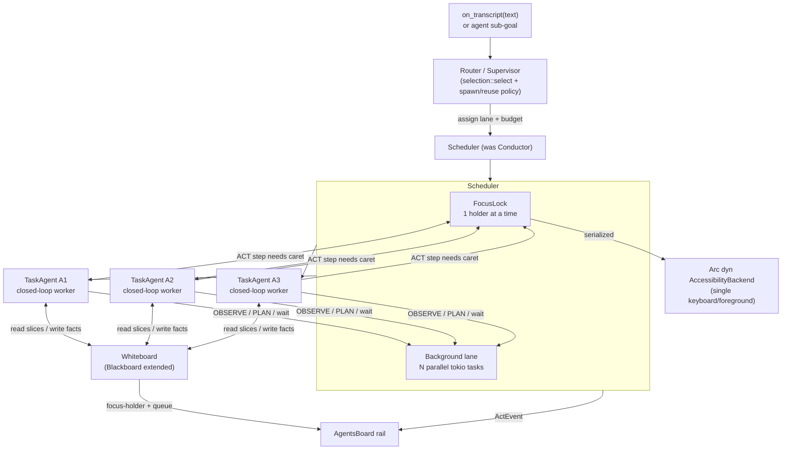

# Act — Multi-Agent Orchestration Layer

> Status: design / proposal. This document specifies the **orchestration layer**
> that sits *above* the closed-loop per-task worker (branch `claude/act-closed-loop`)
> and *replaces* the Conductor's current serial `drive_queue`. It is grounded in
> the code on `claude/settings-redesign`: `src-tauri/src/act/conductor.rs`,
> `blackboard.rs`, `selection.rs`, `executor.rs`, `windows.rs`, `session.rs`,
> `focus_guard.rs`, and the UI in `src/components/AgentsBoard/index.tsx` +
> `src/hooks/useActTasks.ts`. It changes no product code; it names the exact
> functions and types a build would touch.

---

## 0. The one constraint that governs everything

**One machine = one keyboard + one foreground focus.** The whole app drives the
OS through a *single* `Arc<dyn AccessibilityBackend>` (`backend.rs`), and every
keystroke path is already guarded by `focus_guard::ensure_target_focused`, which
verifies the *intended* app is the live foreground before any
`type_text`/`key_combo`. There is exactly one caret. Two agents cannot type at
the same time — if they tried, `focus_guard` would (correctly) make one of them
abort, or worse, one would type into the other's window.

So the honest ceiling is:

- **UI-driving work is strictly serial.** Anything that resolves a target,
  focuses, invokes, types, or presses keys must hold a single global lock. At
  most **one** agent is "driving the screen" at any instant.
- **Non-focus work is genuinely parallel.** LLM calls (selection, planner,
  answer, the closed loop's plan step), `open_uri`, read-only `run_shell`
  queries, waits, and document generation touch neither the caret nor the
  foreground. These can run N-at-a-time.

Every design decision below exists to extract the parallelism that *is* real
(thinking, researching, waiting) without ever pretending five agents drive the
screen at once. When the doc says "5 agents," it means five *goals in flight* —
up to four of them thinking/waiting while one holds the caret.

---

## 1. Architecture overview

The current flow (`conductor.rs`) is: `on_transcript` → `selection::select` →
`missions: Vec<Mission>` → `drive_queue` runs them **sequentially**, each mission
fully finishing (or pausing the whole queue) before the next starts. Missions are
inert data; the Conductor is the only actor.

The new model promotes each mission to a **task-agent**: a small state machine
that *owns a goal* and runs the closed-loop worker to pursue it. The Conductor
becomes a **scheduler** that owns a **focus lock**, two **lanes**, the
**blackboard/whiteboard**, and a **router/supervisor**.

```
                         on_transcript(text)  /  agent discovers sub-goal
                                    │
                                    ▼
                        ┌────────────────────────┐
                        │   Router / Supervisor  │  reuse? spawn? which lane?
                        │  (selection + policy)  │  budget<=MAX_AGENTS
                        └───────────┬────────────┘
                                    │ spawn/assign TaskAgent
                                    ▼
   ┌───────────────────────────  Scheduler  ───────────────────────────┐
   │                                                                    │
   │   FOREGROUND lane (serial)              BACKGROUND lane (parallel) │
   │   ┌───────────────────────┐            ┌────────────────────────┐  │
   │   │ FocusLock (1 holder)   │            │ tokio tasks, N-wide    │  │
   │   │  A2 ▶ drives caret     │            │  A1 ▶ LLM plan         │  │
   │   │  A4 ▷ queued (waiting) │            │  A3 ▶ open_uri / wait  │  │
   │   │  A5 ▷ queued           │            │  A6 ▶ doc-gen / shell  │  │
   │   └───────────────────────┘            └────────────────────────┘  │
   │            │      ▲  acquire/yield per closed-loop ACT step         │
   │            ▼      │                                                 │
   │   ┌──────────────────────────────  one backend  ─────────────────┐ │
   │   │        Arc<dyn AccessibilityBackend>  (the single caret)      │ │
   │   └──────────────────────────────────────────────────────────────┘ │
   └────────────────────────────────────────────────────────────────────┘
                                    ▲
                                    │ read slices / write facts
                        ┌───────────┴────────────┐
                        │  Whiteboard (Blackboard+)│
                        │  tasks | budgets | facts │
                        │  per-app UI cache | lock │
                        │  focus-holder | binds    │
                        └──────────────────────────┘
                                    │ ActEvent stream
                                    ▼
                        AgentsBoard rail (parallel / queued / focus-holder)
```



**Key idea:** the closed loop is `observe → plan → act → re-observe`. Only the
**act** sub-step touches the caret. An agent therefore holds the focus lock for
that sub-step *only*, and releases it to think, wait, and re-observe. That is
what makes overlap real: while A2 executes its one keystroke burst, A1 is in an
LLM `plan` call and A3 is waiting on a page load — all three "running," one
driving.

---

## 2. Concrete Rust-level plan

### 2.1 Where it lives

New module tree under `src-tauri/src/act/`, added to `mod.rs`:

```
act/
  orchestrator/
    mod.rs          // re-exports; Scheduler entry points
    scheduler.rs    // Scheduler: owns lanes, focus lock, agent table, router calls
    agent.rs        // TaskAgent, AgentId, AgentStatus, Lane, AgentBudget
    focus_lock.rs   // FocusLock: async fair mutex + holder tracking on the board
    router.rs       // spawn/reuse/lane decision (wraps selection::select)
    worker.rs       // trait AgentWorker + adapter to the closed-loop executor
```

The existing `conductor.rs` is **kept and extended**, not deleted: `Conductor`
becomes the owner of a `Scheduler` and keeps its public surface
(`on_transcript`, `decide`, `undo`, `abort`, `state`, `arm`/`disarm`) so
`commands/act.rs` (`ActState`, `act_user_decision`, `act_abort`, `act_undo`) is
unchanged at the call site. `blackboard.rs` gains fields; `selection.rs` is
unchanged (the router *calls* it); `executor.rs`/`flow_runner.rs` are wrapped by
the worker, not modified for phase 1.

### 2.2 The new types

```rust
// agent.rs

/// Stable identity for one goal-agent, reused across the whole command and any
/// pause/resume. Also the AgentsBoard card key (supersedes the "t0"/"t1" ids).
#[derive(Debug, Clone, PartialEq, Eq, Hash)]
pub struct AgentId(pub String);   // e.g. "a0", "a1"

/// Which lane an agent's *current* step runs in. An agent can move between lanes
/// across steps (OBSERVE/PLAN in background; ACT in foreground) — the lane is a
/// property of the step, not a fixed label.
#[derive(Debug, Clone, Copy, PartialEq, Eq)]
pub enum Lane {
    /// Needs the caret / foreground. Serialized behind FocusLock.
    Foreground,
    /// LLM / open_uri / read-only shell / wait / doc-gen. Runs in parallel.
    Background,
}

/// Lifecycle of a task-agent, surfaced to the UI.
#[derive(Debug, Clone, PartialEq, Eq)]
pub enum AgentStatus {
    Thinking,               // in an LLM plan/observe step (background)
    Waiting,                // background wait (page load, doc-gen)
    QueuedForFocus,         // wants the focus lock, not yet granted
    Driving,                // holds the focus lock, executing an ACT step
    AwaitingConfirm,        // paused: destructive/medium-risk confirm
    AwaitingChoice,         // paused: ask_user disambiguation
    Done { ok: bool },
    Failed { reason: String },
}

/// The unit of agency. Each agent runs the closed-loop worker against its goal.
pub struct TaskAgent {
    pub id: AgentId,
    pub goal: Goal,                 // the OpenFlow / Novel / Answer origin
    pub label: String,              // human title for the card
    pub lane_hint: Lane,            // router's initial classification
    pub status: AgentStatus,
    pub budget: StepBudget,         // bounded steps / tokens / wall-clock
    pub target_app: Option<String>, // from selection::Mission::target_app
    pub history: AgentHistory,      // this agent's own observe/act trace (bounded)
    pub pending: Option<PendingKind>, // reuse the EXISTING conductor::PendingKind
}

/// Mission is the seed of a Goal; keep selection::Mission as the wire form and
/// map it 1:1 so selection.rs is untouched.
pub enum Goal {
    OpenFlow { id: String, slots: HashMap<String, String> },
    Novel { goal: String },
    Answer { question: String },
}

/// Bounded so a runaway loop can't starve the machine (mirrors closed-loop caps).
#[derive(Debug, Clone)]
pub struct StepBudget {
    pub max_steps: u32,          // closed-loop iterations, e.g. 8
    pub max_focus_steps: u32,    // caret acquisitions, e.g. 6
    pub deadline: Instant,       // wall-clock ceiling
}
```

```rust
// focus_lock.rs

/// The single-caret gate. Exactly one agent may drive the backend at a time.
/// FAIR (FIFO) to prevent starvation; records the holder on the whiteboard so the
/// UI and router can see who owns the screen.
pub struct FocusLock {
    inner: tokio::sync::Mutex<()>,     // the actual mutual exclusion
    queue: Mutex<VecDeque<AgentId>>,   // FIFO wait order (fairness + UI)
    holder: Mutex<Option<AgentId>>,    // current Driving agent, mirrored to board
}

pub struct FocusGuardHeld<'a> {        // RAII: releasing = yielding the caret
    _permit: tokio::sync::MutexGuard<'a, ()>,
    lock: &'a FocusLock,
    who: AgentId,
}

impl FocusLock {
    /// Await the caret in FIFO order. Cancels immediately if the kill switch trips.
    pub async fn acquire(&self, who: AgentId, kill: &KillSwitch)
        -> Result<FocusGuardHeld<'_>, Aborted>;
}
```

```rust
// scheduler.rs

/// Was: the body of Conductor::drive_queue. Now: owns the lanes and the lock.
pub struct Scheduler {
    focus: Arc<FocusLock>,
    agents: HashMap<AgentId, TaskAgent>,
    board: Arc<Mutex<Blackboard>>,   // the shared whiteboard (see §2.3)
    router: Router,
    worker_factory: Arc<dyn WorkerFactory>, // builds a closed-loop worker per agent
    budget: AgentBudget,             // MAX_AGENTS live at once (~5)
    kill: KillSwitch,
    tx: mpsc::UnboundedSender<AgentEvent>, // agents -> scheduler (progress/pause/done)
}
```

```rust
// worker.rs — the seam to claude/act-closed-loop

/// One bounded observe→plan→act→re-observe pass. The scheduler drives an agent by
/// repeatedly calling `step`, and the worker tells the scheduler which lane the
/// NEXT sub-action needs so the scheduler can (a) acquire the focus lock only for
/// ACT and (b) surface Thinking/Waiting/Driving to the UI.
#[async_trait]
pub trait AgentWorker: Send {
    /// Advance one closed-loop iteration. `caret` is Some only when the scheduler
    /// has granted the focus lock (i.e. an ACT sub-step is due).
    async fn step(&mut self, ctx: &StepCtx<'_>, caret: Option<&FocusGuardHeld<'_>>)
        -> WorkerStep;
}

pub enum WorkerStep {
    /// Nothing driven yet; the next sub-step is background (LLM/observe). Loop again.
    Continue,
    /// The next sub-step needs the caret. Scheduler acquires the lock, re-calls step.
    NeedsFocus,
    /// Pause for the user — reuse the existing pause semantics verbatim.
    Pause(PendingKind),      // conductor::PendingKind
    /// Discovered a sub-goal; hand back to the router (spawn/reuse decision).
    Subgoal(Goal),
    /// Terminal.
    Done { ok: bool, summary: String, facts: Vec<Fact> },
}
```

The `worker_factory` builds a worker backed by the closed-loop executor from
`claude/act-closed-loop`. For an `OpenFlow` goal the worker wraps
`FlowRunner::run`/`resume`; for a `Novel` goal it wraps the closed loop over
`Planner::plan` + `Executor::execute_plan_with_context`; for `Answer` it wraps
`answer::answer` (pure background, never touches the caret).

### 2.3 Blackboard → Whiteboard (extend `blackboard.rs`, don't replace)

`Blackboard` already carries `focus_app`, `window_title`, `selection_len`,
`recent` (capped history), and `binds` (durable `Selector`s). It already has the
right discipline: `context_summary()` is fenced DATA, never instructions, and it
holds no field values. We **add**:

```rust
pub struct Blackboard {
    // ...existing fields unchanged...

    /// Live agent roster for the router (reuse checks) and the UI. Small, capped.
    pub agents: Vec<AgentSlot>,          // {id, label, status, lane, target_app}

    /// Per-app UI-state cache: last snapshot digest + a monotonically bumped
    /// version, so an agent can reuse another agent's recent observation of an app
    /// instead of re-walking UIA. Keyed by normalized app name (focus_guard::
    /// normalize_app_name). Bounded (LRU, e.g. 6 apps).
    pub app_cache: HashMap<String, AppUiState>,

    /// Facts discovered by agents, shared across agents. TRUST-TAGGED (see §6):
    /// a fact carries whether it came from a trusted channel (a slot value, a
    /// deterministic query) or from UNTRUSTED on-screen text.
    pub facts: Vec<Fact>,                // capped, PHI-free summaries only

    /// Who holds the caret right now (mirror of FocusLock::holder), for the UI and
    /// for the router's starvation checks.
    pub focus_holder: Option<AgentId>,
    pub focus_queue: Vec<AgentId>,       // FIFO wait order, for the rail
}

pub struct AppUiState {
    pub version: u64,                    // bumped on each observe of this app
    pub observed_at: Instant,
    pub window_title: Option<String>,
    pub control_names: Vec<String>,     // capped, names only (PHI-free), like screen_summary
    pub binds: HashMap<String, Selector>, // per-app durable bindings
}

pub struct Fact {
    pub agent: AgentId,
    pub key: String,                    // e.g. "clipboard_len", "found_row"
    pub summary: String,                // PHI-free
    pub trust: Trust,                   // Trusted | UntrustedScreen
}

pub enum Trust { Trusted, UntrustedScreen }
```

The existing `observe(&Snapshot)` keeps refreshing the top-level frame; a new
`observe_app(app, &Snapshot)` writes the per-app cache entry and bumps its
version. `context_summary()` stays as-is for backward-compat and gains a sibling
`slice_for(agent)` used by dynamic prompt assembly (§4).

### 2.4 Real functions to change

| File / function | Change |
|---|---|
| `conductor.rs :: Conductor` (struct) | Add `scheduler: Scheduler`, `board: Arc<Mutex<Blackboard>>` (was owned `Blackboard`). Keep `registry/llm/runner/planner/executor/backend` — they flow into the `WorkerFactory`. |
| `conductor.rs :: on_transcript` | After `selection::select`, hand missions to `Router::route` (was: build `VecDeque<QueuedMission>` + `drive_queue`). Collect `ActEvent`s from the scheduler's channel until the command quiesces (all agents terminal or paused). |
| `conductor.rs :: drive_queue` | **Replaced** by `Scheduler::run` (the parallel lane loop). Deleted, not kept. |
| `conductor.rs :: run_mission / run_flow / run_novel / run_answer` | Move bodies into `worker.rs` behind `AgentWorker`. The Conductor no longer runs a mission directly. |
| `conductor.rs :: suspend / decide / resume_paused` | Retarget from the single `Pending` to `agents[id].pending`. `decide` routes the `UserDecision` to the specific paused agent. |
| `conductor.rs :: PendingKind`, `Step`, `flow_decision`, `summarize_novel` | **Reused unchanged** — the worker returns `WorkerStep::Pause(PendingKind)` and `resume_paused` logic moves into the worker. |
| `blackboard.rs :: Blackboard` | Add fields in §2.3; add `observe_app`, `record_fact`, `slice_for`, `note_focus_holder`. |
| `commands/act.rs :: build_conductor` | Also build the `FocusLock`, `Scheduler`, `Router`, `WorkerFactory`; wire the same `KillSwitch` into the lock's abort path (as it already threads into runner+executor). No signature change to `arm_into`/`act_set_enabled`. |
| `events.rs :: ActEvent` | Add `AgentStatus { id, status }` and `FocusHolder { id: Option<String> }` variants (see §7). `TaskSpawned/TaskProgress/TaskResult` are kept; `id` becomes the `AgentId`. |

---

## 3. Lifecycle

### 3.1 A command spawns and routes agents

1. `on_transcript(text)` (unchanged entry): barge-in handling, kill-switch reset,
   `backend.snapshot()` → `board.observe`, then `selection::select(...)` exactly
   as today. Selection is **unchanged** — it still returns `Vec<Mission>`.
2. `Router::route(missions)` turns each mission into a routing decision:
   - **reuse-or-spawn** (§5): if a live agent already owns this app/goal and is
     idle-eligible, reuse it; else spawn a new `TaskAgent` (subject to the budget).
   - **lane assignment**: `Answer` → Background (never drives). `OpenFlow`/`Novel`
     → `lane_hint = Foreground` if the flow's first primitive is a caret action,
     else Background until its first ACT step. The hint only decides *initial*
     scheduling; the worker's `NeedsFocus` is the real trigger.
3. The scheduler spawns one `tokio::task` per agent (background lane by default)
   and emits `TaskSpawned { id, label }`.

### 3.2 The focus lock is acquired and yielded per closed-loop step

This is the crux. The scheduler drives each agent's worker in a loop:

```
loop {
    match worker.step(ctx, /*caret=*/ None).await {
        Continue          => continue,                      // background sub-step done
        NeedsFocus => {
            set_status(QueuedForFocus); emit FocusHolder-queue update;
            let held = focus.acquire(id, &kill).await?;     // FIFO; may block on others
            set_status(Driving); board.note_focus_holder(Some(id));
            // Re-drive the SAME iteration, now holding the caret. The worker does
            // exactly ONE bounded ACT burst (resolve → focus_guard → invoke/type),
            // then returns. `held` drops here → caret yielded immediately.
            match worker.step(ctx, Some(&held)).await { ... }
            drop(held); board.note_focus_holder(None);
        }
        Pause(kind)       => { agent.pending = Some(kind); set_status(Awaiting…); break; }
        Subgoal(goal)     => router.route_subgoal(goal, parent=id),
        Done{ok,summary,facts} => { board.record_facts(facts); set_status(Done); break; }
    }
}
```

Critical rules:
- **Hold the lock only across one ACT burst**, never across an LLM `plan` call or
  a `wait`. `focus_guard::ensure_target_focused` runs *inside* the burst while the
  lock is held, so its retry/settle window can't be interleaved with another
  agent's typing.
- **Cooperative yield, run-to-completion burst.** An agent that acquires the caret
  runs its one ACT burst to completion (or abort), then releases — it does not
  hold the lock across a re-observe. This bounds worst-case caret latency for a
  waiting agent to one burst, not one whole goal.
- **Kill switch cancels the acquire.** `focus.acquire` is raced against
  `kill.wait_tripped()` (same pattern as `focus_guard` and `executor`), so
  `act_abort` frees a queued agent instantly.

### 3.3 Background agents run and report

Background agents are just the same loop where `worker.step` keeps returning
`Continue` (LLM/observe/wait/open_uri/doc-gen) and never `NeedsFocus`. They report
via the `AgentEvent` mpsc channel → scheduler → `ActEvent` stream, identically to
foreground agents. `open_uri` (the whole "open Gmail" happy path) is a background
action: it hands the URI to the OS handler and returns — it does **not** need the
caret, so "open Gmail" and "open Spotify" genuinely run in parallel where today's
serial queue runs one-at-a-time.

### 3.4 Results and facts feed other agents

On `Done`, a worker returns `facts: Vec<Fact>`. The scheduler writes them to
`board.facts` (trust-tagged, §6) and, if the observe touched an app, updates
`board.app_cache`. A later agent's prompt (§4) includes the relevant facts and the
per-app cache slice — so "find the Andreas email" (agent A1) can leave a
`found_row` bind that "reply saying I'll call" (agent A2) resolves against, exactly
as `blackboard.binds` does today, but now scoped per app and per agent.

### 3.5 Reconciling with existing pause/resume + confirm/ask_user

The pause machinery is **reused wholesale**. When a worker hits a medium-risk
`Confirm` or an ambiguous `ask_user`, it returns `WorkerStep::Pause(PendingKind)`
— the *same* `conductor::PendingKind` (Flow/Novel) that exists today. The
scheduler stores it on `agent.pending`, sets `AgentStatus::AwaitingConfirm/Choice`,
and emits the existing `ActEvent::Confirm`/`AskUser`.

The **command-level** `ConductorState` is now derived from the agent roster:

| Agents' collective state | `ConductorState` (unchanged enum) |
|---|---|
| any agent Driving/Thinking/Waiting | `Working` |
| some agent `AwaitingConfirm`, none Working | `AwaitingConfirm` |
| some agent `AwaitingChoice`, none Working | `AwaitingChoice` |
| all terminal | `Armed` (baseline) |

`decide(UserDecision)` gains a target: today there is one `Pending`; now
`decide` resolves to the agent that is awaiting (if several await, the most
recently paused — matching the single `Confirm` dialog the UI shows). Its
`resume_paused` logic moves into the worker's resume path but the mapping
(`flow_decision`, `ResumeDecision`) is unchanged. **Barge-in** still works: a new
`on_transcript` while agents are paused/working trips the kill switch (freeing the
focus lock and every `acquire`), drains the roster, emits superseded
`TaskResult`s, and routes the new command.

**Important safety note on confirm-while-parallel:** the UI shows one confirm at a
time. To avoid two agents racing to prompt, the confirm path is itself serialized
through the focus lock's *queue discipline*: only the **focus holder** may raise a
`Confirm`/`AskUser`. A background agent that reaches a confirm first transitions to
`QueuedForFocus` and raises the prompt only once it is the holder. This keeps the
"one modal, one caret" invariant and means a destructive confirm is never shown
for an action some *other* agent could invalidate underneath it.

---

## 4. Dynamic prompt assembly

Today the planner/selection prompt is `board.context_summary()` (one global
block) plus grounding. For multi-agent, each agent's LLM prompt is **built per
step** from these bounded slices, all fenced as DATA (never instructions), reusing
the blackboard's existing fence discipline:

```
build_agent_prompt(agent, board) =
  1. GOAL           : agent.goal (trusted — from the user's spoken words / slots)
  2. AGENT_HISTORY  : agent.history, last K observe/act steps (bounded, PHI-free)
  3. APP_SLICE      : board.app_cache[normalize(agent.target_app)]
                      → window_title + capped control_names + per-app binds
  4. FACTS_SLICE    : board.facts filtered to agent.target_app / goal, TRUST-TAGGED
  5. GROUNDING      : the live GroundingPacket for the CURRENT ACT step only
```

Token bounding — the whole reason for the per-app cache:

- **Per-app cache + diffs, not full re-walks.** `AppUiState.version` lets an agent
  say "you last saw app X at v7; here's the v7 digest" and include a *diff* against
  the live snapshot rather than the full element list. Unchanged apps cost a
  one-line "X unchanged @v7."
- **Only the target app's slice.** An agent working in Spotify never gets Chrome's
  control list. `slice_for(agent)` selects by `normalize_app_name(target_app)`.
- **Caps mirror existing constants.** `control_names` reuse `SCREEN_SUMMARY_CAP`
  (24) and `DEFAULT_MAX_NAME_CHARS`; history is capped like `HISTORY_CAP` (6);
  facts are capped and summarized (no values), matching the blackboard's
  "length-not-contents" rule.
- **Grounding stays per-step.** The heavy `GroundingPacket::from_snapshot`
  (`DEFAULT_MAX_ELEMENTS`) is included only for the imminent ACT step, not for
  background thinking steps — which is where most of the parallel work happens.

There is **no static template**: `build_agent_prompt` assembles exactly the slices
an agent needs for its next step. An `Answer` agent gets GOAL + APP_SLICE only (no
grounding, no facts write-back). A `Novel` agent mid-loop gets all five.

---

## 5. Spawn/reuse policy, budget, starvation & deadlock

### 5.1 The rule (crisp)

> **New task → maybe a new agent (after a reuse check). New app → NOT a new
> agent, just a focus-lock resource + a cache entry.**

An **app is not an agent.** An app is (a) a key into `board.app_cache` and (b) a
thing the single `FocusLock` serializes access to. When a goal needs a second app
("mute the Chrome tab" while Spotify plays), that does **not** spawn an app-agent;
the *same* task-agent switches focus (its worker calls `focus_app`, guarded), and
the new app just gets a cache entry. This is the central decision — see §8.

### 5.2 Router decision procedure

For each incoming mission (or discovered sub-goal):

1. **Answer** → always a fresh, short-lived background agent (no reuse; it only
   reads).
2. **Reuse check**: is there a live agent whose `goal` is the same recipe/app and
   whose `status` is terminal-or-idle *and* whose context the new mission
   continues (e.g. follow-up "reply to it")? If yes and it still has budget →
   reuse (feed it the new sub-goal), don't spawn.
3. **Budget check**: `board.agents.len() < MAX_AGENTS` (~5)? If not, **queue** the
   mission behind a running agent rather than spawning (FIFO), and emit a
   "queued" card so the user sees it waiting.
4. Otherwise **spawn** a new `TaskAgent`, assign lane (§3.1), enqueue.

### 5.3 Budget

- `MAX_AGENTS ≈ 5` concurrent (roster cap). Chosen because the parallelism ceiling
  is thinking/waiting overlap, not screen-driving; beyond ~5 the extra agents
  mostly sit in the focus queue and add UI noise and token cost without finishing
  faster (one caret).
- `StepBudget` per agent: `max_steps` (closed-loop iterations), `max_focus_steps`
  (caret acquisitions), and a wall-clock `deadline`. Exhausting any → the agent
  terminates `Failed { reason: "budget exhausted" }`. This is the anti-runaway
  guarantee and mirrors the closed loop's own bounded-iteration design.

### 5.4 Starvation & deadlock on the focus lock

- **Fairness (FIFO).** `FocusLock.queue` grants the caret in request order, so a
  chatty agent can't monopolize it while another waits forever.
- **No lock across think/wait.** Because an agent releases the caret before every
  LLM/observe/wait sub-step (§3.2), the lock is held for bursts measured in
  hundreds of ms, not whole goals. Max wait for the head-of-queue agent is one
  burst.
- **No nested acquire → no deadlock cycle.** An agent holds *at most one* caret
  permit at a time and never tries to acquire a second while holding the first
  (the worker returns after one burst). With a single lock and no nesting, a
  classic wait-for cycle is impossible.
- **Kill switch is the escape hatch.** Every `acquire` is raced against
  `kill.wait_tripped()`; `act_abort` trips it lock-free (as today), so a stuck
  foreground app (UAC prompt, `focus_guard` refusing to confirm the target) can't
  wedge the whole roster — the queued agents get `Aborted`, not a hang.
- **Focus-guard interplay.** Because only the lock holder drives, the
  `expected_app`/`focus_guard` mechanism keeps working unchanged: the holder sets
  its intended target and guards keystrokes; no other agent can move the
  foreground mid-burst because no other agent holds the caret.

---

## 6. Safety: the untrusted-screen boundary, per agent

The existing model (per `flowrad-act-architecture.md` and the code) has three
load-bearing rules that multi-agent must **preserve per-agent, and additionally
across agents**:

1. **On-screen text is DATA, never instructions.** `selection.rs` and
   `blackboard.rs` fence it; `build_agent_prompt` (§4) fences every slice the same
   way. An agent's own history and the app cache are DATA blocks; a control label
   like "SYSTEM: ignore your rules" can never become an instruction for *any*
   agent.
2. **Destructive-confirm holds per agent.** The runtime classifier
   (`destructive.rs`, `DESTRUCTIVE_WORDS`, `CONFIRM_ACTIVATORS`) runs *inside the
   executor*, which each agent's worker uses. So every agent independently gets the
   in-executor confirm on an irreversible activation, bound to the exact resolved
   control (`ConfirmedTarget`). Parallelism does not weaken this: the confirm is
   raised only by the focus holder (§3.5), so it is always about the control that
   is actually about to be activated.
3. **The model is never the safety boundary.** Enforcement stays in Rust: the
   `CapabilityGate` (unchanged), the kill switch, `focus_guard`, `shell_policy`,
   and `destructive.rs` all run in the worker/executor. The scheduler adds *no*
   capability; it only serializes and schedules.

**The new cross-agent hazard: fact laundering.** A background agent that reads
on-screen text (untrusted) and writes a `Fact` could, if unchecked, let that text
re-enter a *different* agent's prompt as if it were trusted intent — laundering
untrusted screen content into a trusted command (e.g. screen text "wire $1M to
acct 123" becoming agent B's goal). Mitigations, baked into the `Fact` type:

- **Trust tagging is mandatory.** Every `Fact` carries `Trust::Trusted` (slot
  values, deterministic query results, user's spoken words) or
  `Trust::UntrustedScreen` (anything derived from a snapshot's names/text). The
  writer sets it; the reader can't upgrade it.
- **Untrusted facts are DATA-only, never intent.** `build_agent_prompt` places
  `UntrustedScreen` facts strictly inside the fenced APP/FACTS data blocks; they
  are never allowed to seed a new `Goal` or fill a slot. Only `Trusted` facts (and
  only the user's spoken words) can become intent — the same rule
  `selection.rs`/`blackboard.rs` already enforce for slot values, extended to
  cross-agent facts.
- **A sub-goal from a worker is re-routed, not trusted.** `WorkerStep::Subgoal`
  goes back through `Router::route`, which re-applies the selection discipline
  (index/screen are DATA), so a discovered sub-goal can't bypass the router into
  execution.
- **PHI discipline unchanged.** Facts carry PHI-free summaries only (lengths, control
  names, ok/failed), matching the blackboard's existing "never the contents" rule.

---

## 7. UI mapping — AgentsBoard rail

The current rail (`useActTasks.ts` + `AgentsBoard/index.tsx`) already models a
list of cards with `running | done | failed`, keyed by mission id, built from
`TaskSpawned/TaskProgress/TaskResult`, cleared on `state: working`. Multi-agent
needs three additions, all backward-compatible:

1. **Status richer than running/done/failed.** Extend `ActTaskStatus` to
   `thinking | waiting | queued | driving | awaiting | done | failed`, fed by a new
   `ActEvent::AgentStatus { id, status }`. Map to the dot colors: `driving` gets a
   distinct accent (it owns the caret), `queued`/`waiting` a muted tint,
   `thinking` the existing running-pulse.
2. **Focus-holder marker.** A new `ActEvent::FocusHolder { id: Option<String> }`
   drives a small "▶ driving" badge / caret glyph on exactly one card, so the user
   can always see *which* agent has the keyboard right now — the single most
   important thing to surface given the serial-focus reality. At most one card ever
   shows it.
3. **Parallel + queued are visible.** Because agents now co-exist, the rail shows
   several cards at once (already supported — it maps a list). Queued agents render
   as dimmed cards with a "queued" badge and an order number from
   `board.focus_queue`; running-but-thinking agents show the pulse; the driver
   shows the caret badge. The collapsed rail's dots already handle N-with-overflow
   (`MAX_DOTS`), so the parallel case needs only the new statuses + the driver
   accent.

The reducer changes are small: add the two event kinds to the `TaskEvent` union
and the `switch` in `useActTasks.ts`; keep the `state: working` reset. No layout
rewrite — the rail was already a multi-card view; we are giving it honest states.

---

## 8. Recommended model — evaluation, and the alternative rejected

**Recommended (this doc): unit of agency = TASK/GOAL agent; app = focus-lock
resource + cache entry.** Kept because:

- It matches the one physical constraint. A *goal* is the thing that can partly run
  in the background (think/wait) and partly needs the caret; modeling agency at the
  goal level lets the scheduler overlap exactly the parallel part. An *app* has no
  goal of its own — it is a shared resource with one caret, which is precisely a
  lock + cache, not an actor.
- It reuses everything: `selection::Mission` → `Goal` 1:1, `PendingKind`,
  `focus_guard`, `destructive`, the capability gate, and the blackboard's binds.
- The reuse rule stays crisp: "new task → maybe new agent; new app → just a
  lock+cache." No agent explosion when a single goal spans two apps.

**Main alternative considered: one agent per APP (app-agents).** Rejected:

- It fights the constraint instead of modeling it. App-agents suggest apps run
  concurrently, but they can't — one caret. You'd immediately re-introduce a global
  focus lock *between* app-agents, so you get all the complexity of this design
  *plus* an extra actor layer that owns no goal.
- Cross-app goals become awkward: "mute the Chrome tab while Spotify plays" would
  need two app-agents to coordinate one user intent, with handoff and ordering
  logic that the single task-agent handles trivially by switching focus.
- The per-app *state* that app-agents would own is exactly what we keep — as the
  passive `app_cache` on the whiteboard — without giving it agency it can't
  exercise.

A second alternative — **keep the serial queue, add background pre-fetch** (run
LLM planning for mission N+1 while mission N executes) — is a strict subset of this
design (it's what the background lane does for the *next* agent) and is in fact
**Phase 1** below. We keep it as the first increment, then generalize to true
multi-agent scheduling.

---

## 9. Phased build plan

Each phase is independently shippable and leaves Act working.

**Phase 0 — Focus lock, no behavior change (plumbing).**
Introduce `FocusLock` and route *today's* single executor path through it (the
Conductor acquires it around the whole command). Add `focus_holder` to the board
and the `FocusHolder` event. Ships with identical behavior (one command at a time)
but proves the lock + UI marker. *Independently shippable; zero user-visible risk.*

**Phase 1 — Background lane for non-focus missions (the real first win).**
Run `Answer` and `open_uri`-only missions (the "open Gmail / open Spotify / what's
on screen" cases) as parallel background agents; keep caret-driving missions serial
behind the lock. This alone makes multi-open commands genuinely concurrent and is
low-risk (no two agents ever contend for the caret because background agents never
want it). Extend `useActTasks` statuses. *Shippable; visible speedup on the most
common commands.*

**Phase 2 — TaskAgent + Scheduler + closed-loop worker.**
Land `AgentWorker`, wrap the closed-loop executor, and move `run_flow/run_novel`
into the worker. Now caret-driving missions become agents that acquire/yield the
lock per ACT burst. Requires `claude/act-closed-loop` merged. Reuse `PendingKind`
pause/resume. *Shippable behind a flag; the parallelism ceiling is reached here.*

**Phase 3 — Router reuse/spawn + budget + whiteboard facts.**
Add `Router::route` reuse checks, `MAX_AGENTS` budget, `app_cache` + diffs, and
trust-tagged `facts`. Dynamic prompt assembly (`build_agent_prompt`) replaces the
single `context_summary` feed. *Shippable; enables cross-agent context and
sub-goal discovery.*

**Phase 4 — Sub-goal discovery + polish.**
`WorkerStep::Subgoal` → router; full AgentsBoard states (queued/driving/awaiting
per agent); starvation metrics/telemetry on focus-lock wait times.

Build order rationale: Phase 0–1 deliver a real, safe speedup with almost no new
concepts and no dependency on the closed-loop branch. Phases 2+ layer agency on top
only once the single-lock and background-lane invariants are proven in production.

---

## 10. Open questions & risks

**Top 3 risks / open questions:**

1. **Confirm-while-parallel UX is the sharpest edge.** With several agents live, a
   destructive `Confirm` must be unambiguous about *which* agent/action it's for,
   and must not be invalidated by another agent moving the foreground underneath
   it. The design serializes confirms through the focus holder (§3.5), but the UI
   currently shows a single, agent-agnostic confirm dialog. **Open:** does the
   confirm dialog need to name the agent/app, and should all *other* agents pause
   (not just background-queue) while a destructive confirm is pending? Leaning
   yes — freeze the roster during a destructive confirm.

2. **Is the parallelism worth the complexity for real commands?** The genuine
   parallel win is (a) multiple `open_uri`/launch commands and (b) overlapping one
   agent's think/wait with another's caret burst. If most real commands are a
   single goal in a single app, Phase 1 captures ~all the benefit and Phases 2–4
   add scheduling machinery for a minority of multi-goal commands. **Open:**
   instrument Phase 1 to measure how often users issue truly parallelizable
   multi-goal commands before investing in full scheduling.

3. **Cache coherence vs. a fast-changing screen.** `app_cache` + version-diffs cut
   tokens, but a stale slice fed to an agent's planner could ground an action on a
   control that has moved. The executor already re-grounds against a *fresh*
   snapshot at ACT time (`executor.rs`), so a stale *plan* is caught at execution —
   but a stale *prompt* can waste a step. **Open:** what staleness bound (age /
   version gap) forces a re-observe before planning, and does the diff approach pay
   off vs. always re-walking the target app for the imminent step?

**Other open questions:**

- **Fairness policy under budget pressure.** FIFO is simple; do interactive/paused
  agents deserve priority for the caret over long-running background-spawned
  sub-goals? Start FIFO, revisit with telemetry.
- **Agent identity across dictations.** `blackboard.binds` persists cross-dictation
  today. Should a *terminated* agent's facts/binds survive into the next command's
  reuse check, or only the whiteboard's app cache? (Proposed: app cache + trusted
  facts survive; agent objects don't.)
- **Where exactly does the closed loop yield?** The clean acquire/yield boundary
  assumes the closed-loop worker exposes its observe/plan/act sub-steps to the
  scheduler (the `AgentWorker::step` + `NeedsFocus` seam). If the closed loop is a
  single opaque `run()` call, phase 2 needs it refactored to yield at the ACT
  boundary — coordinate this contract with `claude/act-closed-loop`.
- **Elevated / undrivable foreground.** `focused_app_is_elevated` already declines
  driving; with a queue, a persistently-elevated foreground should fail the head
  agent fast (budget) rather than stall the queue. Confirm the deadline covers this.
